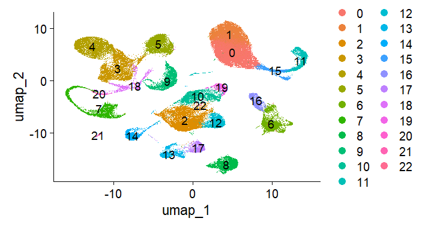
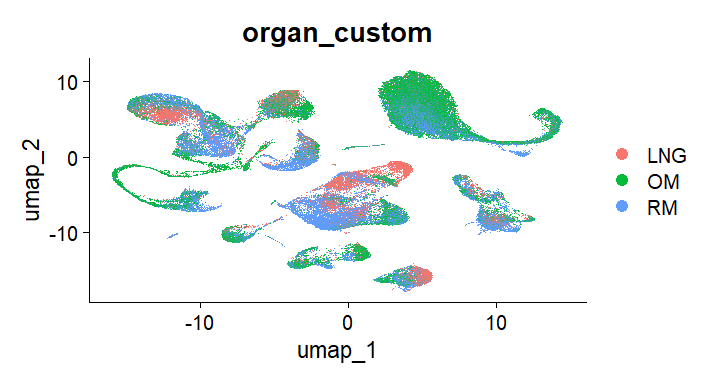
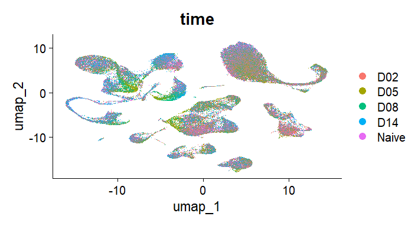
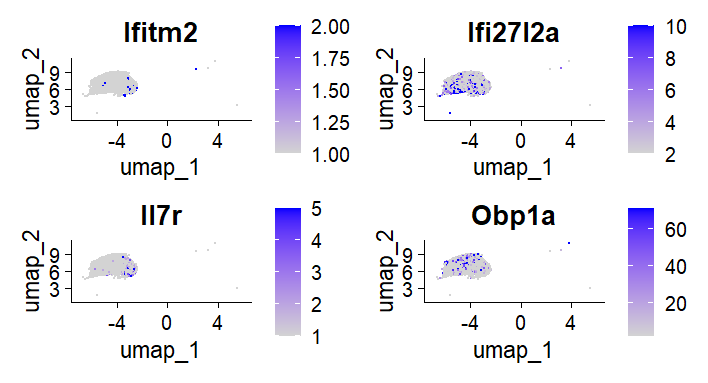
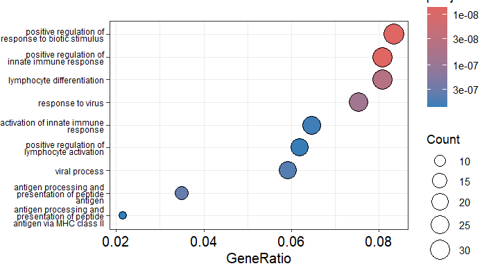

# Single-Cell-Seq

### RESULTS

**Figure 1. UMAP visualization of clustered single-cell transcriptomic data.** UMAP projection of all cells showing 23 transcriptionally distinct clusters identified using Seurat clustering. Each point represents a single cell, colored by cluster identity. The clear separation of clusters indicates distinct gene expression profiles across cell populations.

**Figure 2. Distribution of cells across tissue types.** UMAP projection colored by tissue of origin: respiratory mucosa (RM) , olfactory mucosa (OM) , and lateral nasal gland (LNG). Cells from different tissues are distributed across multiple clusters, with some regions showing tissue-specific enrichment, indicating both shared and tissue-specific cellular populations.

**Figure 3 Distribution of cells across infection time points.** UMAP projection colored by infection stage (Naive, D02, D05, D08, D14). Cells from different time points are broadly distributed across clusters, with localized enrichment in specific regions, suggesting dynamic transcriptional changes during infection progression.

Single-cell RNA sequencing data were analyzed to characterize cellular differences and infection-associated changes in transcription across nasal tissues in mice. Dimensionality reduction and clustering identified 23 distinct cell populations, visualized using UMAP (Figure 1). Clusters were well separated, indicating distinct transcriptional profiles across cell populations. Overlay of metadata revealed that cells from different tissues (RM, OM, LNG) and different time points were broadly distributed across clusters. Although, certain regions showed enrichment for specific conditions, suggesting that there are some condition-specific cellular states observed. (Figures 2-3).

To identify populations associated with the dynamics of infection, cluster composition across time points was examined. Cluster 5 displayed a notable shift in abundance between the early (D05) and late (D14) infection stages, with a significant amount of transcription at the early stage. This pattern suggested that Cluster 5 may be involved in infection-related responses and was therefore selected for downstream analysis.

### Table 1. Differentially expressed genes in Cluster 5 (D14 vs D05)

| Gene    | p_val   | avg_log2FC | pct.1 | pct.2 | p_val_adj |
|---------|--------|------------|-------|-------|-----------|
| Obp1a   | 2.74E-98 | -310.216  | 0.278 | 0.731 | 6.88E-94 |
| Ifitm2  | 5.87E-40 | -3.012    | 0.117 | 0.341 | 1.48E-35 |
| Ifi213  | 3.27E-37 | -4.889    | 0.025 | 0.150 | 8.22E-33 |
| Ifi27l2a| 1.73E-35 | -4.236    | 0.391 | 0.648 | 4.35E-31 |
| Lef1    | 7.60E-35 | -7.226    | 0.019 | 0.128 | 1.91E-30 |
| Il7r    | 1.53E-34 | -1.839    | 0.027 | 0.150 | 3.84E-30 |
| Map1b   | 1.08E-33 | -10.133   | 0.850 | 0.585 | 2.73E-29 |
| H2-Aa   | 2.42E-33 | 6.331     | 0.910 | 0.762 | 6.07E-29 |
| Vpreb1  | 5.86E-33 | -14.464   | 0.012 | 0.101 | 1.47E-28 |
| Pafah1b3| 4.85E-32 | -6.104    | 0.122 | 0.327 | 1.22E-27 |

[View full Table 1 (CSV)](DE_results.csv)

**Figure 4. Expression of select differentially expressed genes in Cluster 5.** Feature plots showing expression of representative genes (*Ifitm2*, *Ifi27l2a*, *Il7r*, and *Obp1a*) within Cluster 5. Expression is localized to subsets of cells, indicating transcriptional heterogeneity within this population and supporting differential expression results across infection stages.

Differential expression analysis within Cluster 5 comparing D14 and D05 revealed notable transcriptional changes (Table 1). Several genes associated with antiviral responses were seen to be significantly enriched at the earlier time points, including interferon-stimulated genes such as *Iftim2* and *Ifi27l2a*. Additional immune-related genes including *Il7r* and *Lef1*, were also differentially expressed, indicating involvement of lymphocyte-associated processes. Visualization of selected genes using FeaturePlot demonstrated that their expression was localized to subsets of cells with Cluster 5, indicating heterogeneity in this population (Figure 4).

**Figure 5. Gene ontology enrichment analysis of differentially expressed genes.** Dot plot showing enriched biological processes for genes differentially expressed between D05 and D14 within Cluster 5. Dot size represents gene count and color indicates adjusted p-value. Enriched pathways include antiviral response, innate immune activation, lymphocyte differentiation, and antigen processing, consistent with an immune response to infection.

Functional enrichment analysis of differentially expressed genes further supported these observations. Gene ontology analysis revealed significant enrichment of pathway related to antiviral response, innate immune activation, lymphocyte differentiation, and antigen processing and presentation (Figure 5). These results strongly indicate that cluster 5 is involved in coordinated immune responses during infection.

### Table 2. Top 15 marker genes for Cluster 5 with proportional expression values between time points

| Gene    | log2FC | pct_D14 | pct_D05 |
|---------|--------|---------|---------|
| Igkc    | 166.40 | 0.92    | 0.02    |
| Iglc1   | 133.67 | 0.36    | 0.00    |
| Iglc3   | 99.63  | 0.61    | 0.01    |
| Iglc2   | 74.13  | 0.65    | 0.00    |
| Dnajc7  | 45.47  | 0.41    | 0.40    |
| Ighm    | 42.22  | 0.92    | 0.11    |
| Vpreb3  | 38.07  | 0.52    | 0.03    |
| Ms4a1   | 31.45  | 0.68    | 0.00    |
| Fau     | 27.97  | 1.00    | 1.00    |
| Jund    | 23.64  | 0.99    | 0.92    |
| Ighd    | 20.36  | 0.56    | 0.00    |
| Cd79b   | 17.89  | 0.87    | 0.03    |
| Smarca4 | 17.61  | 0.21    | 0.32    |
| Cd37    | 17.47  | 0.79    | 0.08    |
| Fcmr    | 16.73  | 0.53    | 0.00    |

[View full Table 2 (CSV)](cluster5_top15_markers.csv)

To further elucidate the identity of this population, marker gene analysis was performed. Cluster 5 displayed strong expression of canonical B-cell markers. These included immunoglobulin genes (*Igkc*, *Ighm*, *Ighd*) and B-cell receptor components (Cd79b, Ms4a1). These markers were highly enriched relative to other cell populations, confirming that Cluster 5 represents a B-cell population. A summary of the top marker genes is provided in Table 2.

